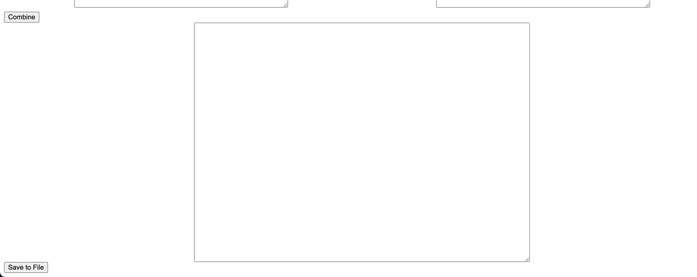

# Church Lyrics

## `Description`

This app is intended to help assembly in a easier and fast way songs and translation for the OpenLP projection software.

## `The inputs are:`

- Song Title
- Song Author
- Lyrics in first language (we use portuguese)
- Lyrics in second language (we use german)

## `The output is:`

after filling the inputs you can combine the two languages by clicking on the Combine button and you be able to see the result of the combination and the if all OK you can hit save to file and choose where to save the file.

## `Hosted App`

## `Tech Stack`

- React
- primereact
- primeflex

## `Project setup`

1. Clone repo
2. Install dependencies
   `npm install`
3. To run the app in development mode npm start, then open http://localhost:3000 to view it in the browser
